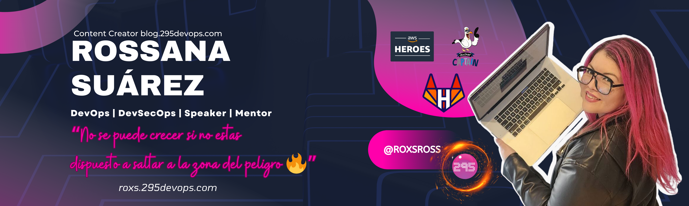

# [Hello, Hello I'm Roxs]

## ¡Bienvenid@s a la zona onfire de GitHub!

#### 🤔 &nbsp;¿Quién soy? 

Me llamo Rossana Suarez @roxsross y actualmente trabajo como Tech Lead DevOps. Me encanta programar y la tecnología en general, por eso en él hablo de todo esto. 
De lo que vivo, de lo que aprendo y de lo que hago con la tecnología en mi día a día.
 

<samp>
    AWS Hero Container 🚀
      
    GITLAB Hero 🚀
      
    Docker Captain 🐳
     
    AWS Community Builder Program Container ⚡
      
    Speaker and Mentor 🦸‍♀️
     
    "No se puede crecer si no estas dispuesto a saltar a la zona del peligro 🔥"

<samp>
 
     
     
    
#### 🥰 &nbsp;Me gusta... 

🌲 &nbsp;Senderismo 
✈️ &nbsp;Viajar 
🎬 &nbsp;Ir al cine 
🎞️ &nbsp;Mirar Series 
🧑‍💻 &nbsp;Codear 

### Mis estadísticas

  
  

### ✉️  &nbsp;Contacto 

Me puedes encontrar en:

<samp>
"Para entender algo no debes entenderlo sino serlo"
<samp>
  

  
   

